# Il modello dei dati

<!-- Generato da scripts/genera-modello.js. Non si modifica a mano: si cambia
     lo schema in models/ o la politica in config/relations.js e si rilancia
     `npm run modello`. -->

Le classi sono gli schemi in [models/](../models), le frecce i loro riferimenti.
L'etichetta dice cosa succede al documento puntato quando si cancella il padre:

- **blocca** — la cancellazione e rifiutata finche esistono documenti collegati
  (freccia tratteggiata);
- **cascata** — i collegati vengono cancellati insieme (freccia piena);
- **conserva** — il collegato resta e il riferimento puo restare appeso, perche
  tiene gia la sua copia di cio che gli serve (il giornale delle modifiche).

Le politiche sono dichiarate in [config/relations.js](../config/relations.js), in
un posto solo, e sono le stesse che usa il rapporto di integrita.

```mermaid
classDiagram
    class Articolo {
        String codice
        String descrizione
        String iva
        Ref _id
    }
    class AuditLog {
        String entityType
        Ref entityId
        String action
        String summary
        Ref actor
        String actorUsername
        String actorRole
        Mixed[] changes
        Mixed metadata
        Ref _id
        Date createdAt
    }
    class Cliente {
        String ragione_sociale
        String cognome
        String nome
        String sesso
        Boolean socio
        Number quote
        String con_commerciali
        Date data_nascita
        String comune_nascita
        String provincia_nascita
        String indirizzo_residenza
        String numero_residenza
        String cap_residenza
        String localita_residenza
        String provincia_residenza
        String nazione_residenza
        String destinazione_fatturazione
        String indirizzo_fatturazione
        String numero_fatturazione
        String cap_fatturazione
        String localita_fatturazione
        String provincia_fatturazione
        String nazione_fatturazione
        String codice_fiscale
        String partita_iva
        String stampa_cortesia
        String telefono
        String cellulare
        String cellulare2
        String email
        String pagamento
        Date data_mandato_sdd
        String email_pec
        String codice_destinatario
        Boolean fattura_elettronica
        String codice_cliente_erp
        String iban
        String note
        Ref _id
    }
    class Consegna {
        Ref fattura
        Ref cliente
        String tipo
        String canale
        String destinatario
        String progressivo
        String documento
        String intestatario
        String stato
        Boolean automatica
        Number tentativi
        String ultimo_errore
        Date data_invio
        String riferimento
        Boolean simulata
        String[] allegati
        String note
        Ref _id
        Date createdAt
        Date updatedAt
    }
    class Contatore {
        String tipo_contatore
        String codice
        String nome_cliente
        String seriale_interno
        String nome_edificio
        String tipo_attivita
        String seriale
        Boolean inattivo
        Number consumo
        Boolean condominiale
        Date inizio
        Date scadenza
        String causale
        String note
        String foto
        Ref precedente
        Ref listino
        Ref cliente
        Ref edificio
        Ref _id
    }
    class Edificio {
        String descrizione
        String indirizzo
        String numero
        String cap
        String localita
        String provincia
        String nazione
        String attivita
        Number posti_letto
        Number latitudine
        Number longitudine
        Number unita_abitative
        String catasto
        String foglio
        String ped
        String estensione
        String tipo
        String note
        Ref _id
    }
    class Fascia {
        String tipo
        Number min
        Number max
        Number prezzo
        Date inizio
        Date scadenza
        Ref listino
        Ref _id
    }
    class Fattura {
        String tipo_documento
        String ragione_sociale
        Boolean confermata
        Number anno
        Number numero
        Date data_fattura
        String codice
        String serie
        String destinazione
        Number imponibile
        Number iva
        Number totale_fattura
        Date data_fattura_elettronica
        Date data_invio_fattura
        String tipo_pagamento
        String nome_cliente
        String stato
        String origine
        Ref cliente
        Ref scadenza
        Ref _id
        Date createdAt
        Date updatedAt
    }
    class InvoiceCounter {
        String scope
        Number year
        Number value
        Ref _id
        Date createdAt
        Date updatedAt
    }
    class Lettura {
        String id_lettura
        Date data_lettura
        String unita_misura
        Number consumo
        Boolean fatturata
        String tipo
        String note
        Ref contatore
        Ref _id
    }
    class Listino {
        String categoria
        String descrizione
        Ref _id
    }
    class NoteAttachment {
        String resource
        Ref recordId
        String field
        String filename
        String contentType
        Number size
        Buffer data
        Ref _id
        Date createdAt
        Date updatedAt
    }
    class Scadenza {
        Date scadenza
        Boolean saldo
        Date pagamento
        Number anno
        Number numero
        String cognome
        String nome
        Number totale
        Number solleciti
        Boolean mora_fatturata
        Ref _id
    }
    class Servizio {
        Number riga
        String descrizione
        String tipo_tariffa
        String tipo_attivita
        Number metri_cubi
        Number prezzo
        Number valore_unitario
        String tipo_quota
        String seriale_condominio
        String lettura_precedente
        String lettura_fatturazione
        Date data_lettura
        String descrizione_attivita
        Ref lettura
        Ref articolo
        Ref listino
        Ref fascia
        Number aliquota_iva
        Mixed calcolo_snapshot
        Ref fattura
        Ref _id
        Date createdAt
        Date updatedAt
    }
    class User {
        String username
        String password
        String email
        String numero_telefono
        String role
        Ref cliente
        Boolean active
        Ref _id
    }
    User "1" ..> "*" AuditLog : actor (conserva)
    Fattura "1" --> "*" Consegna : fattura (cascata)
    Cliente "1" ..> "*" Consegna : cliente (blocca)
    Contatore "1" ..> "*" Contatore : precedente (blocca)
    Listino "1" ..> "*" Contatore : listino (blocca)
    Cliente "1" ..> "*" Contatore : cliente (blocca)
    Edificio "1" ..> "*" Contatore : edificio (blocca)
    Listino "1" --> "*" Fascia : listino (cascata)
    Cliente "1" ..> "*" Fattura : cliente (blocca)
    Scadenza "1" ..> "*" Fattura : scadenza (blocca)
    Contatore "1" ..> "*" Lettura : contatore (blocca)
    Lettura "1" ..> "*" Servizio : lettura (blocca)
    Articolo "1" ..> "*" Servizio : articolo (blocca)
    Listino "1" ..> "*" Servizio : listino (blocca)
    Fascia "1" ..> "*" Servizio : fascia (blocca)
    Fattura "1" --> "*" Servizio : fattura (cascata)
    Cliente "1" ..> "*" User : cliente (blocca)
```

Ogni riferimento presente negli schemi ha la sua politica dichiarata.
